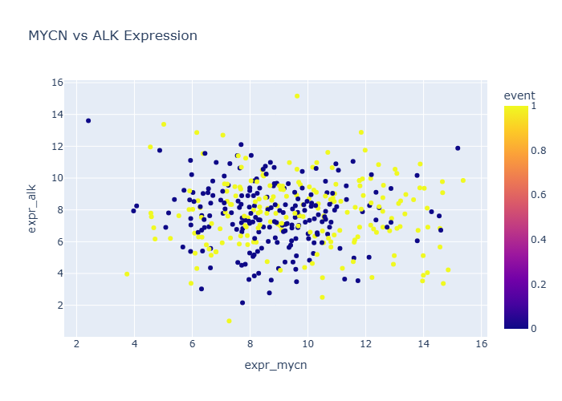

# Insights: Biomarker Mycn Vs Alk

## Medical Insight
- This figure provides exploratory clinical context for cohort phenotype and outcomes.

## Research Insight
- The bivariate structure can motivate interaction terms and subgroup analyses around MYCN/ALK axes.

## Caveat
- Insights are non-causal and exploratory. Missing cells in source data: 0. Measurement error, confounding, and sample-size limits may alter conclusions.
