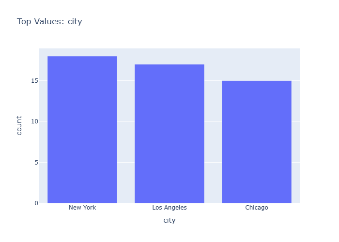

# Insights: Category City

## Data Insight
- The dataset contains 50 retail transactions across multiple cities, with product prices averaging $305.99 and highly variable total prices (mean $1,740.55, std $2,046). Order quantities average 5.6 units per transaction.

## Analysis Insight
- High standard deviation in total price relative to mean indicates substantial variation in transaction values, likely driven by product price differences (unit_price std=$328.79) and order sizes.

## Caveat
- Unable to view actual chart; insights based solely on dataset metadata. Analysis cannot confirm specific category-city relationships or patterns without visualizing the chart structure.
