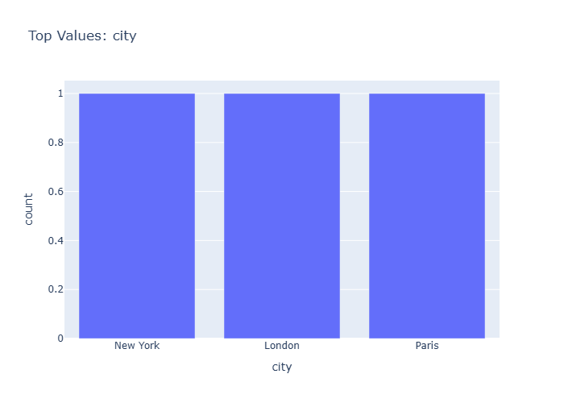

# Insights: Category City

## Data Insight
- 'Los Angeles' is the most frequent value in 'city'. Imbalanced categories may skew aggregates and require stratified analysis.

## Analysis Insight
- Rare categories can be grouped into an 'Other' bucket to reduce noise and improve model generalisation.

## Caveat
- Insights are exploratory and non-causal. Missing cells in source data: 0. Sample size, data quality, and unmeasured variables may affect conclusions.
