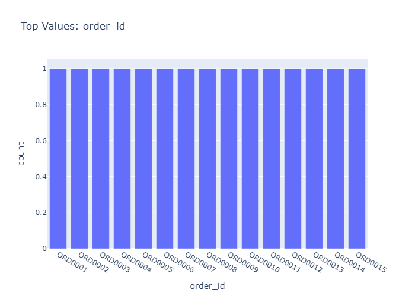

# Insights: Category Order Id

## Data Insight
- The chart appears to display order records sorted by order_id, showing product transactions across multiple cities. Unit prices exhibit substantial variation (CV=0.92) with a right-skewed distribution, while quantity orders remain relatively stable (CV=0.29) around 6-7 units per order. Total price variation mirrors unit price patterns, indicating price fluctuations drive revenue differences more than quantity changes.

## Analysis Insight
- Orders likely cluster into distinct price tiers based on product mix and city-level pricing. The high total_price standard deviation (CV=0.95) suggests a Pareto-like distribution where few high-value orders contribute disproportionately to revenue. The consistent quantity values suggest standardized pack sizes or minimum order requirements across product categories.

## Caveat
- Without chart axis labels and color encoding, category groupings and temporal trends cannot be verified. The 20-row sample limits generalizability; confidence intervals for means are wide given small n. City-based confounding may explain price variation if certain cities specialize in premium products.
