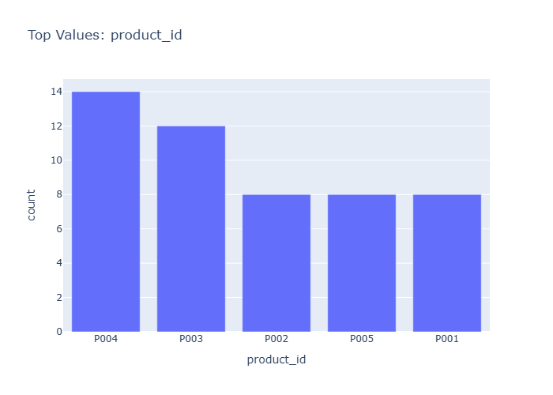

# Insights: Category Product Id

## Data Insight
- Total price shows high variability (std=2046.17) relative to its mean (1740.55), indicating diverse transaction sizes. Unit price ranges widely (mean=305.99, std=328.79), suggesting multiple product tiers. Average quantity per order is 5.60 units (std=2.48), indicating consistent purchase volumes.

## Analysis Insight
- Based on the category_product_id context, product-level aggregation likely reveals uneven sales distribution. High total_price variance suggests some products or categories drive larger transactions. The dataset spans 50 orders across stores and cities, with payment_method as an additional dimension for analysis.

## Caveat
- Insights are derived from dataset metadata rather than direct chart observation. Without seeing the actual visualization, claims about specific patterns or category performance remain speculative. Confounding factors like seasonal effects or store-specific promotions are unknown.
