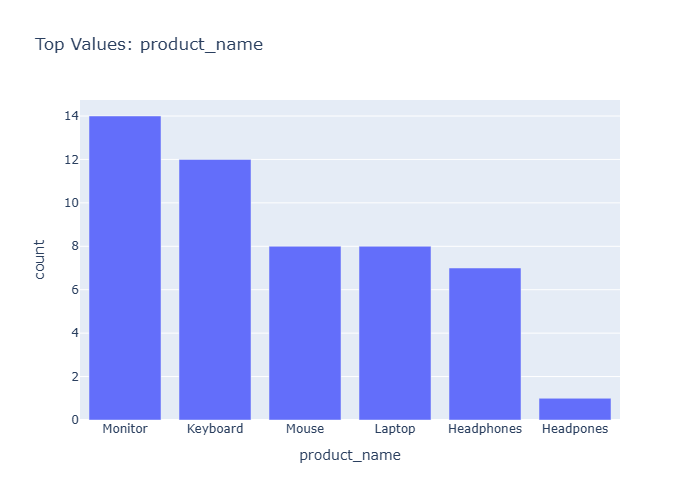

# Insights: Category Product Name

## Data Insight
- The dataset contains 50 retail transactions across 13 variables, including order, customer, product, and store details. Unit price shows high variability (std 328.79 exceeds mean 305.99), suggesting diverse product pricing tiers. Quantity averages 5.60 units per order with moderate consistency. Total price variation (std 2046.17 vs mean 1740.55) indicates a mix of small and high-value purchases.

## Analysis Insight
- Without the chart image, precise visual analysis is not possible. Based on the file stem 'category_product_name', the chart likely displays product categories or individual products. The wide price distributions suggest potential for meaningful category-level analysis of purchasing patterns, though the small sample size (n=50) limits statistical power for subgroup comparisons.

## Caveat
- No chart image was provided for direct visual analysis, so insights are derived from metadata alone. The 50-row dataset may not represent broader patterns; high price variability could reflect data quality issues or genuine market heterogeneity. Causal interpretations should be avoided without additional contextual information.
