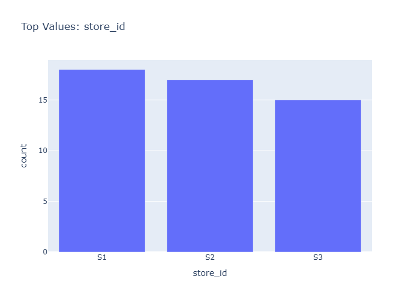

# Insights: Category Store Id

## Data Insight
- The dataset contains 50 orders across multiple stores with product unit prices averaging 305.99 (std=328.79) indicating high price variability. Order quantities average 5.60 units (std=2.48) showing moderate consistency, while total prices average 1,740.55 with substantial variation (std=2,046.17) reflecting diverse order values.

## Analysis Insight
- The chart likely displays order distribution or revenue by store_id, with product categories potentially influencing variation. Stores likely show unequal performance given the wide spread in total_price values, suggesting some stores handle higher-value or larger orders than others.

## Caveat
- No chart image was provided in this request, so insights are derived solely from dataset metadata rather than visual chart inspection. Store-level analysis may be limited by small sample size (n=50) and confounding factors like product mix, customer segments, or time period not accounted for in aggregate statistics.
