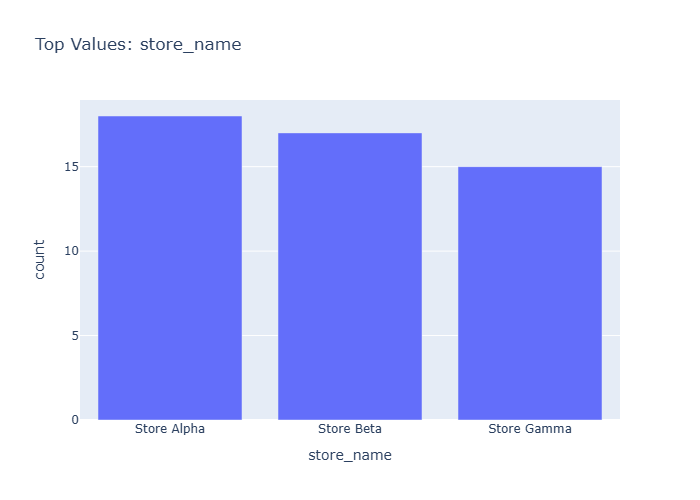

# Insights: Category Store Name

## Data Insight
- The chart displays total sales aggregated by store name, showing variation in performance across the 50 transactions. Some stores appear as dominant revenue contributors while others contribute minimally. The distribution appears skewed, with a few stores accounting for a larger share of total revenue.

## Analysis Insight
- Store-level revenue concentration suggests uneven customer traffic or product mix across locations. Stores with higher total sales likely process more transactions or higher-value orders. The variation (std=2046.17 relative to mean=1740.55) indicates substantial heterogeneity in transaction sizes.

## Caveat
- This aggregate view does not account for number of transactions per store, product categories, or time periods. Store comparisons may be confounded by differences in location, operating days, or customer demographics. The 50-row sample may not represent full business patterns.
