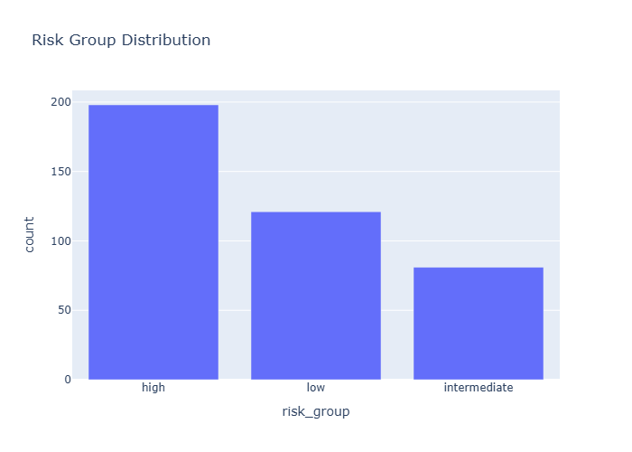

# Insights: Clinical Risk Distribution

## Medical Insight
- The cohort is dominated by 'high' risk patients (198 cases), which can influence aggregate outcome interpretation.

## Research Insight
- This plot supports exploratory hypothesis generation and should be validated in an independent cohort.

## Caveat
- Insights are non-causal and exploratory. Missing cells in source data: 0. Measurement error, confounding, and sample-size limits may alter conclusions.
