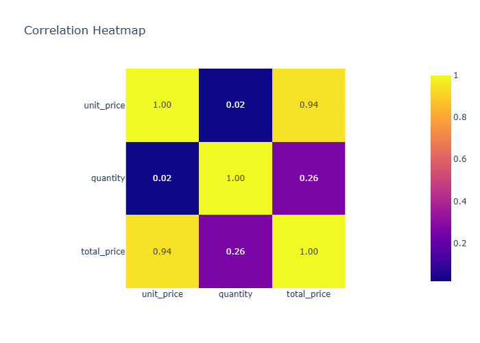

# Insights: Correlation Heatmap

## Data Insight
- The strongest correlation is between 'unit_price' and 'total_price' (r ≈ 0.94), suggesting these columns move together and may be related.

## Analysis Insight
- Use this map to reduce collinearity in downstream models and prioritise orthogonal feature subsets.

## Caveat
- Insights are exploratory and non-causal. Missing cells in source data: 0. Sample size, data quality, and unmeasured variables may affect conclusions.
