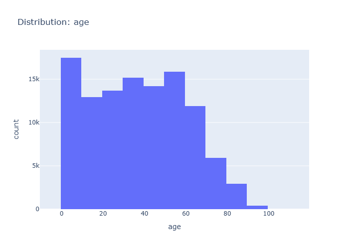

# Insights: Distribution Age

## Data Insight
- The histogram shows the distribution of patient ages, representing the count of patients within specific age ranges. The highest counts are observed for the youngest age groups, with a noticeable decline in patient numbers as age increases, particularly after age 60.

## Analysis Insight
- The age distribution is right-skewed, indicating that the majority of patients are younger. There are smaller, but still significant, counts of older patients. The distribution suggests a broad range of patient ages, with a concentration in the younger to middle-aged demographics.

## Caveat
- The chart displays counts per age bin, not the exact age of each patient. This aggregation may obscure finer patterns within age groups. The dataset's scope (e.g., specific clinic or region) could influence the observed age distribution.
