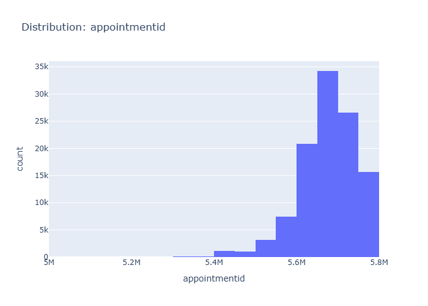

# Insights: Distribution Appointmentid

## Data Insight
- The histogram shows the distribution of 'appointmentid'. The majority of appointment IDs are concentrated in the higher range, specifically in bins around 5.6M to 5.8M, with a peak count exceeding 30,000. There are very few appointments with IDs below 5.4M.

## Analysis Insight
- The distribution of 'appointmentid' appears to be right-skewed, with a long tail of lower counts at the lower end of the ID range. The mode is located in the 5.7M to 5.8M range, indicating most appointments fall within this identifier group.

## Caveat
- The 'appointmentid' is likely an arbitrary numerical identifier. Its distribution may not reflect any meaningful underlying trend or characteristic of the appointments themselves. The observed structure could be an artifact of how these IDs were generated or assigned sequentially.
