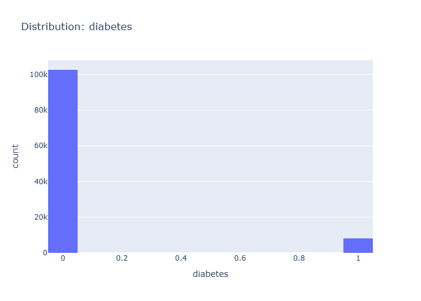

# Insights: Distribution Diabetes

## Data Insight
- The distribution of diabetes shows that the vast majority of patients in the dataset do not have diabetes (count close to 100k). Only a small fraction of patients have been diagnosed with diabetes (count around 10k).

## Analysis Insight
- The dataset is heavily imbalanced concerning diabetes status. The number of patients without diabetes is significantly higher than those with diabetes, which is a crucial factor for any subsequent analysis or modeling.

## Caveat
- The chart only shows the distribution of diabetes based on the recorded data. It does not account for undiagnosed cases or potential data entry errors, which could affect the true prevalence of diabetes in the population.
