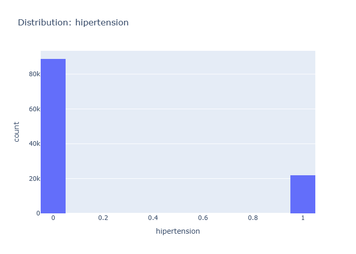

# Insights: Distribution Hipertension

## Data Insight
- The histogram shows a clear bimodal distribution for hypertension status. Approximately 85,000 individuals have a hypertension value of 0 (likely indicating no hypertension), and around 21,000 individuals have a hypertension value of 1 (likely indicating hypertension).

## Analysis Insight
- The majority of the patient population in this dataset does not have hypertension. The prevalence of hypertension appears to be significantly lower than the absence of it, with a ratio of roughly 4:1.

## Caveat
- The chart uses binary categories (0 and 1) for hypertension, which may oversimplify a complex medical condition. The dataset doesn't provide information on the source or accuracy of this hypertension data, nor does it account for potential confounding factors.
