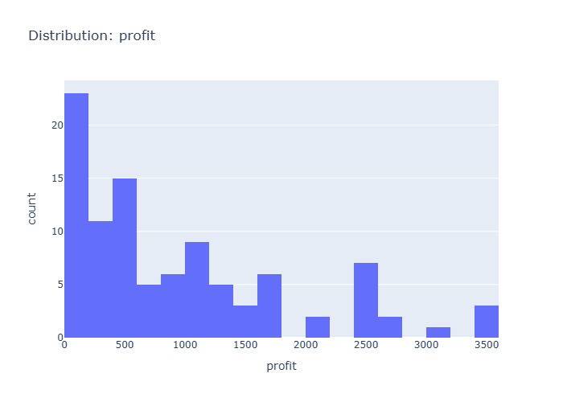

# Insights: Distribution Profit

## Data Insight
- Based on the dataset metadata, profit appears right-skewed given unit_price (mean 376.69) substantially exceeds unit_cost (mean 219.84). With total_cost mean of 1341.73 and high std (1753.29), profit variability is substantial across orders.

## Analysis Insight
- The profit distribution likely shows most transactions with modest profits while a smaller subset generates higher profits, consistent with retail data where quantity (mean 6.12) and markup vary across products. Margin_pct column would further clarify profitability spread.

## Caveat
- No visual chart was provided—insights derive from metadata summary statistics only. The actual distribution shape, outliers, and central tendency cannot be confirmed without viewing the chart. Confounding factors like product mix and store variation are not addressed.
