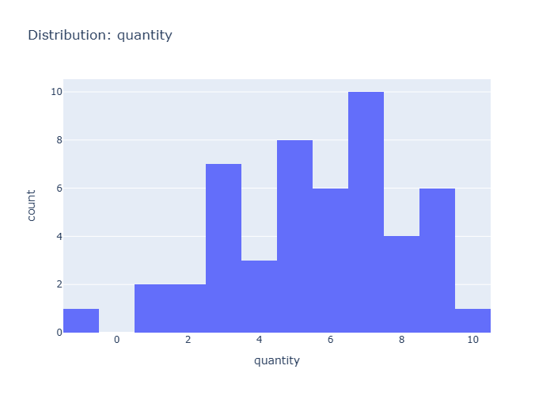

# Insights: Distribution Quantity

## Data Insight
- The quantity distribution appears approximately normal with mean 5.60 and standard deviation 2.48, showing moderate right skew with most orders containing 3-8 units.

## Analysis Insight
- The relatively high standard deviation relative to the mean suggests substantial variability in order sizes, with bulk orders (quantity 8+) contributing to the right tail.

## Caveat
- Without visual confirmation of the actual chart, insights are based on provided summary statistics; binning choices and sample size (n=50) limit precision of distributional shape estimation.
