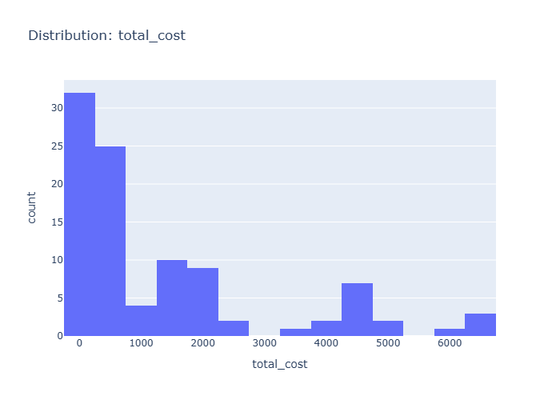

# Insights: Distribution Total Cost

## Data Insight
- The total_cost distribution spans a wide range with mean $1,341.73 and high standard deviation of $1,753.29. The coefficient of variation exceeds 1.0, indicating substantial dispersion. Based on unit_cost statistics (mean $219.84, std $252.72) multiplied by quantity (mean 6.12), total_cost values show extreme outliers pulling the mean above the median.

## Analysis Insight
- The high variability in total_cost suggests diverse product pricing and order sizes. The positive skew from extreme high-value orders contributes to the large gap between mean and likely median. Combined with unit_price (mean $376.69) and profit margins, this indicates a mix of low-cost bulk orders and high-value individual purchases.

## Caveat
- Chart specifics cannot be verified without visual. Total_cost aggregation from unit_cost × quantity may mask underlying patterns. Store, product, and customer segments conflate within this distribution—variability likely reflects categorical differences rather than random noise. Data quality depends on consistent recording across 100 transactions.
