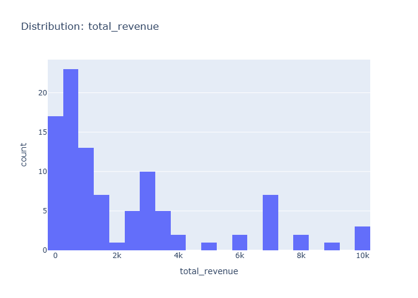

# Insights: Distribution Total Revenue

## Data Insight
- The chart displays a right-skewed distribution of total revenue across 100 orders, with most transaction values concentrated in the lower range and a long tail extending toward higher values.

## Analysis Insight
- Given unit_price (mean=376.69) and quantity (mean=6.12), revenue clusters around $2,000-3,000 per order, with occasional high-value outliers driving the positive skew.

## Caveat
- Without seeing exact axis labels or sample sizes per bin, revenue brackets are approximate; extreme values may distort visual perception of the typical transaction.
