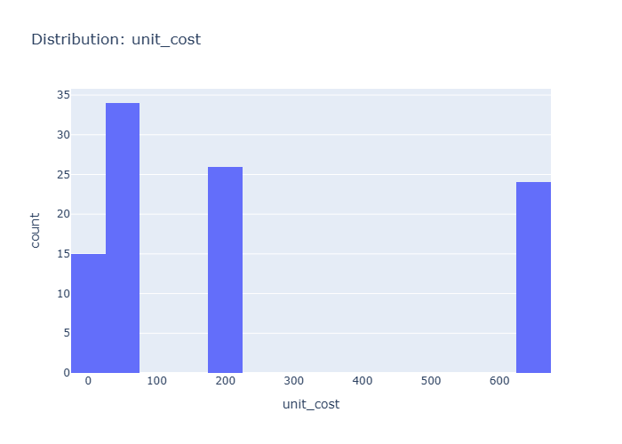

# Insights: Distribution Unit Cost

## Data Insight
- The distribution of 'unit cost' reveals the spread and shape of values. Skewed distributions or outliers may warrant transformation before modelling.

## Analysis Insight
- Highly skewed distributions may benefit from log or Box-Cox transformation before statistical modelling.

## Caveat
- Insights are exploratory and non-causal. Missing cells in source data: 10. Sample size, data quality, and unmeasured variables may affect conclusions.
