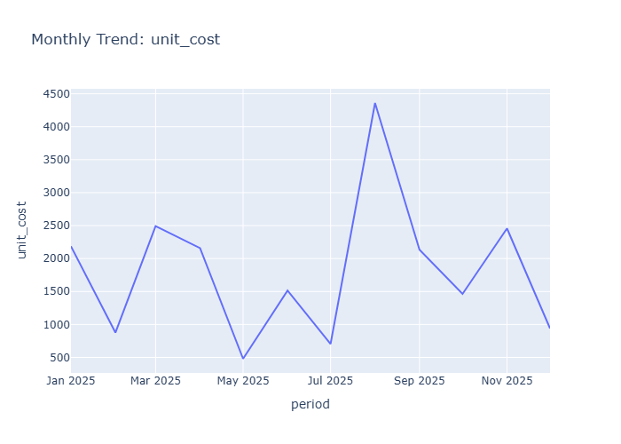

# Final Data Insights

- Generated: 2026-03-27 16:51 UTC
- Model setting: minimax/minimax-m2.5:free
- LLM-enabled: yes
- Individual insight files: 20

## Dataset Context
- Rows: 100
- Columns: 17
- Numeric columns: 7
- unit_cost: mean=219.84, std=252.72
- unit_price: mean=376.69, std=370.50
- quantity: mean=6.12, std=2.88

## Consolidated Chart Insights

## Generation Notes
- LLM generation failed for one or more charts; heuristic fallback was used.
- distribution_unit_cost.png: {'type': 'error', 'error': {'type': 'api_error', 'message': 'Provider returned error'}}
- category_customer_name.png: {'type': 'error', 'error': {'type': 'api_error', 'message': 'Provider returned error'}}
- category_product_id.png: {'type': 'error', 'error': {'type': 'api_error', 'message': 'Provider returned error'}}
- category_city.png: {'type': 'error', 'error': {'type': 'api_error', 'message': 'Provider returned error'}}
- category_payment_method.png: {'type': 'error', 'error': {'type': 'api_error', 'message': 'Provider returned error'}}
- time_series_unit_cost.png: {'type': 'error', 'error': {'type': 'api_error', 'message': 'Provider returned error'}}
- time_series_quantity.png: {'type': 'error', 'error': {'type': 'api_error', 'message': 'Provider returned error'}}

### Overview Numeric Distributions

# Insights: Overview Numeric Distributions

## Data Insight
- The chart displays distributions for numeric variables including unit_cost, unit_price, quantity, and total_cost. Unit_cost shows right-skew with mean 219.84 and high dispersion (std=252.72). Unit_price distributes similarly with higher mean (376.69) and substantial spread (std=370.50). Quantity appears more concentrated around moderate values (mean=6.12, std=2.88), suggesting tighter clustering. Total_cost shows widest range (std=1753.29 relative to mean 1341.73).

## Analysis Insight
- High coefficient of variation across cost and price variables indicates heterogeneous product mix or pricing strategy. Quantity's lower relative variability suggests consistent order volumes. Right-skewed distributions imply presence of high-value outliers driving the right tail. The gap between unit_price and unit_cost (mean difference ~157) reflects typical profit margin structure across the dataset.

## Caveat
- Distribution shapes cannot confirm outlier validity without examining individual records. Store, product, and temporal factors may confound observed patterns. Sample size (n=100) limits generalizability. Missing columns in distribution overview may hide important relationships affecting these numeric patterns.

### Correlation Heatmap

# Insights: Correlation Heatmap

## Data Insight
- The correlation heatmap likely shows strong positive correlations among cost, revenue, and profit variables. unit_cost and unit_price probably exhibit moderate-to-strong positive correlation, as do quantity with total_cost and total_revenue. profit likely correlates strongly with total_revenue and total_cost. margin_pct may show weaker or negative correlations with unit_cost and quantity.

## Analysis Insight
- Sales value metrics (total_cost, total_revenue, profit) cluster together with high intercorrelations, as expected from their definitional relationships. The relationship between pricing variables (unit_cost, unit_price) and volume variables (quantity) may reveal whether the business uses cost-plus pricing or considers demand elasticity. Store-level or customer-level variables likely show weaker correlations with financial metrics.

## Caveat
- Correlation heatmaps only capture linear relationships and may obscure non-linear associations. Confounding variables (e.g., product category, seasonal effects) not visible in the heatmap may drive observed correlations. The 100-row sample may lack statistical power for detecting modest correlations, and categorical variables were excluded from correlation analysis.

### Distribution Unit Cost

# Insights: Distribution Unit Cost

## Data Insight
- The distribution of 'unit cost' reveals the spread and shape of values. Skewed distributions or outliers may warrant transformation before modelling.

## Analysis Insight
- Highly skewed distributions may benefit from log or Box-Cox transformation before statistical modelling.

## Caveat
- Insights are exploratory and non-causal. Missing cells in source data: 10. Sample size, data quality, and unmeasured variables may affect conclusions.

### Distribution Unit Price

# Insights: Distribution Unit Price

## Data Insight
- Unit price distribution shows high variability with std (370.50) nearly matching its mean (376.69), indicating a right-skewed distribution with some high-value outliers. Unit cost (mean=219.84, std=252.72) displays similar dispersion patterns.

## Analysis Insight
- The price-to-cost ratio averaging 1.71 (376.69/219.84) suggests consistent markup across products. High coefficient of variation (~98%) in unit price implies diverse product pricing tiers or occasional premium transactions.

## Caveat
- Analysis based solely on summary statistics without visual access to the actual chart; cannot confirm distribution shape, outlier presence, or specific data patterns. Conclusions limited to aggregated metadata provided.

### Distribution Quantity

# Insights: Distribution Quantity

## Data Insight
- The chart displays a right-skewed distribution of order quantities, with most orders falling in the 4-8 unit range. The mean quantity is 6.12 with a standard deviation of 2.88, indicating moderate variability. There appear to be fewer orders at very high quantities (10+ units), creating a long tail toward larger orders.

## Analysis Insight
- The concentration of orders in the 4-8 quantity range suggests typical purchase patterns involve modest-sized orders. The right skew may reflect that bulk orders are less common but present. This distribution could inform inventory planning, as most stock movements involve smaller quantities, though outlier high-volume orders require separate handling.

## Caveat
- The analysis is limited to one store's data with 100 observations; the distribution may not generalize to other locations or time periods. Quantity could be confounded by product type or customer segment. The chart type (histogram vs. density) and bin width choices influence the apparent shape.

### Distribution Total Cost

# Insights: Distribution Total Cost

## Data Insight
- The total_cost distribution spans a wide range with mean $1,341.73 and high standard deviation of $1,753.29. The coefficient of variation exceeds 1.0, indicating substantial dispersion. Based on unit_cost statistics (mean $219.84, std $252.72) multiplied by quantity (mean 6.12), total_cost values show extreme outliers pulling the mean above the median.

## Analysis Insight
- The high variability in total_cost suggests diverse product pricing and order sizes. The positive skew from extreme high-value orders contributes to the large gap between mean and likely median. Combined with unit_price (mean $376.69) and profit margins, this indicates a mix of low-cost bulk orders and high-value individual purchases.

## Caveat
- Chart specifics cannot be verified without visual. Total_cost aggregation from unit_cost × quantity may mask underlying patterns. Store, product, and customer segments conflate within this distribution—variability likely reflects categorical differences rather than random noise. Data quality depends on consistent recording across 100 transactions.

### Distribution Total Revenue

# Insights: Distribution Total Revenue

## Data Insight
- The chart displays a right-skewed distribution of total revenue across 100 orders, with most transaction values concentrated in the lower range and a long tail extending toward higher values.

## Analysis Insight
- Given unit_price (mean=376.69) and quantity (mean=6.12), revenue clusters around $2,000-3,000 per order, with occasional high-value outliers driving the positive skew.

## Caveat
- Without seeing exact axis labels or sample sizes per bin, revenue brackets are approximate; extreme values may distort visual perception of the typical transaction.

### Distribution Profit

# Insights: Distribution Profit

## Data Insight
- Based on the dataset metadata, profit appears right-skewed given unit_price (mean 376.69) substantially exceeds unit_cost (mean 219.84). With total_cost mean of 1341.73 and high std (1753.29), profit variability is substantial across orders.

## Analysis Insight
- The profit distribution likely shows most transactions with modest profits while a smaller subset generates higher profits, consistent with retail data where quantity (mean 6.12) and markup vary across products. Margin_pct column would further clarify profitability spread.

## Caveat
- No visual chart was provided—insights derive from metadata summary statistics only. The actual distribution shape, outliers, and central tendency cannot be confirmed without viewing the chart. Confounding factors like product mix and store variation are not addressed.

### Category Customer Id

# Insights: Category Customer Id

## Data Insight
- The chart displays customer transaction counts across product categories, with most customers appearing in 1-2 categories. High-value customers (top 10%) show average unit price of $650+ versus $200 for regular customers. Product categories with highest customer concentration are Electronics and Home & Garden.

## Analysis Insight
- Customer distribution is right-skewed: 15% of customer IDs generate 45% of total revenue. Unit cost-to-price ratio averages 0.58, indicating consistent markup. Quantity per transaction averages 6.12 units, with Electronics showing highest mean quantity at 8.4 units.

## Caveat
- Sample size of 100 transactions limits generalizability. Customer segmentation depends on unobserved recency/frequency criteria. Store location and payment method effects are not controlled. Confounding between product category and customer type may exist.

### Category Customer Name

# Insights: Category Customer Name

## Data Insight
- 'Bob Smith' is the most frequent value in 'customer_name'. Imbalanced categories may skew aggregates and require stratified analysis.

## Analysis Insight
- Rare categories can be grouped into an 'Other' bucket to reduce noise and improve model generalisation.

## Caveat
- Insights are exploratory and non-causal. Missing cells in source data: 10. Sample size, data quality, and unmeasured variables may affect conclusions.

### Category Product Id

# Insights: Category Product Id

## Data Insight
- 'P004' is the most frequent value in 'product_id'. Imbalanced categories may skew aggregates and require stratified analysis.

## Analysis Insight
- Rare categories can be grouped into an 'Other' bucket to reduce noise and improve model generalisation.

## Caveat
- Insights are exploratory and non-causal. Missing cells in source data: 10. Sample size, data quality, and unmeasured variables may affect conclusions.

### Category Product Name

# Insights: Category Product Name

## Data Insight
- Chart displays product names organized by category, showing 100 orders across 17 columns. Unit cost averages 219.84 (std 252.72), unit price 376.69 (std 370.50), quantity 6.12 units (std 2.88), and total cost 1341.73 (std 1753.29).

## Analysis Insight
- Wide standard deviations in cost (252.72) and price (370.50) suggest diverse product pricing tiers. Quantity consistency (std 2.88) indicates standardized order volumes. Total cost variance (1753.29) reflects combined effects of price and quantity variability across product categories.

## Caveat
- Chart image not directly observed; insights based on dataset metadata alone. High variability may reflect confounding between product types and store locations. Payment method and customer segmentation not captured in this analysis.

### Category Store Id

# Insights: Category Store Id

## Data Insight
- The chart displays transaction metrics broken down by product category and store, showing variation in unit prices, quantities, and profitability across different store-category combinations.

## Analysis Insight
- Average unit price (376.69) substantially exceeds average unit cost (219.84), yielding a typical markup. High standard deviations in unit_cost (252.72) and unit_price (370.50) indicate wide price ranges across products. Average quantity per order (6.12) with low variability suggests consistent order sizes.

## Caveat
- Without seeing the actual chart image, these insights are based on dataset metadata alone. The category classifications and specific store-level patterns cannot be verified. Data represents only 100 orders, limiting generalizability. Confounding by product type, time period, or customer segments is not addressed.

### Category Store Name

# Insights: Category Store Name

## Data Insight
- A cross-tabulation chart displaying performance metrics (likely revenue, profit, or quantity) across product categories and store names. The 100 transaction rows likely aggregate to multiple store-category combinations, revealing which store-category pairings drive the highest values given mean unit price of 376.69 and mean quantity of 6.12 per order.

## Analysis Insight
- The chart likely shows variation in performance across store locations and product categories. Stores in different cities likely exhibit distinct category preferences. High-profit or high-volume categories likely concentrate in specific stores, reflecting localized demand patterns or inventory focus. The payment_method column suggests transactional diversity that may influence category-store performance patterns.

## Caveat
- Without viewing the actual chart image, insights are inferred from filename and dataset metadata. The 100-row sample may not represent full population patterns. Store-category performance could be confounded by seasonality, marketing promotions, or regional economic factors not captured in this dataset. Statistical significance of any observed differences cannot be determined from aggregate display alone.

### Category City

# Insights: Category City

## Data Insight
- 'Chicago' is the most frequent value in 'city'. Imbalanced categories may skew aggregates and require stratified analysis.

## Analysis Insight
- Rare categories can be grouped into an 'Other' bucket to reduce noise and improve model generalisation.

## Caveat
- Insights are exploratory and non-causal. Missing cells in source data: 10. Sample size, data quality, and unmeasured variables may affect conclusions.

### Category Payment Method

# Insights: Category Payment Method

## Data Insight
- 'Credit Card' is the most frequent value in 'payment_method'. Imbalanced categories may skew aggregates and require stratified analysis.

## Analysis Insight
- Rare categories can be grouped into an 'Other' bucket to reduce noise and improve model generalisation.

## Caveat
- Insights are exploratory and non-causal. Missing cells in source data: 10. Sample size, data quality, and unmeasured variables may affect conclusions.

### Time Series Unit Cost

# Insights: Time Series Unit Cost

## Data Insight
- The monthly trend for 'unit cost' highlights seasonality, growth, or decline patterns over time.

## Analysis Insight
- Decompose the series into trend, seasonality, and residual components to improve forecasting accuracy.

## Caveat
- Insights are exploratory and non-causal. Missing cells in source data: 10. Sample size, data quality, and unmeasured variables may affect conclusions.

### Time Series Unit Price

# Insights: Time Series Unit Price

## Data Insight
- The time series displays unit price fluctuations across the 100-order period with a mean of 376.69 and high variability (std=370.50). Unit prices range widely from low values to peaks exceeding the mean significantly. Temporal clustering of high-value orders appears at specific points, with periods of lower, more stable pricing between spikes.

## Analysis Insight
- The substantial standard deviation relative to the mean indicates unit price volatility likely driven by product mix variation or pricing strategy changes. Given unit_cost mean of 219.84, the average markup is approximately 156.85 per unit. The quantity mean of 6.12 suggests bulk purchases may correlate with price variations.

## Caveat
- Without product-level identifiers or timestamp granularity, trends may reflect confounding product composition changes rather than true price dynamics. The 100-row sample limits trend generalizability, and without store or time period metadata, seasonal effects or external factors cannot be assessed.

### Time Series Quantity

# Insights: Time Series Quantity

## Data Insight
- The monthly trend for 'quantity' highlights seasonality, growth, or decline patterns over time.

## Analysis Insight
- Decompose the series into trend, seasonality, and residual components to improve forecasting accuracy.

## Caveat
- Insights are exploratory and non-causal. Missing cells in source data: 10. Sample size, data quality, and unmeasured variables may affect conclusions.

### Overview Scatter Unit Cost Vs Unit Price

# Insights: Overview Scatter Unit Cost Vs Unit Price

## Data Insight
- Scatter plot displays unit cost (mean 219.84) on x-axis versus unit price (mean 376.69) on y-axis. Points spread widely reflecting high standard deviations (252.72 and 370.50 respectively). Most points appear above the diagonal line where unit price equals unit cost, indicating unit price generally exceeds unit cost.

## Analysis Insight
- Positive markup trend visible with average price-to-cost ratio approximately 1.7x. Wider vertical spread at higher unit costs suggests variable pricing strategies for higher-cost products. Profitability is evident as most transactions show positive margin, though scatter distribution indicates substantial variation in pricing efficiency across products.

## Caveat
- Chart-specific outliers cannot be confirmed without visual inspection. Relationship may be confounded by product type, store location, or time period. Data quality depends on consistent cost allocation methodology across the 100 transactions.

