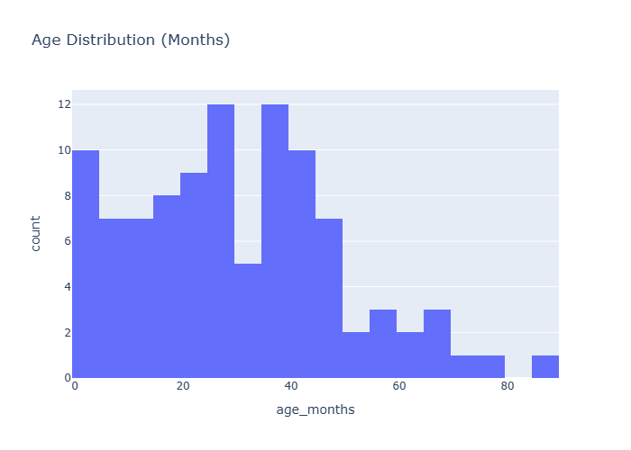
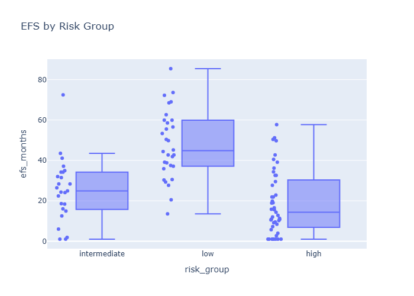
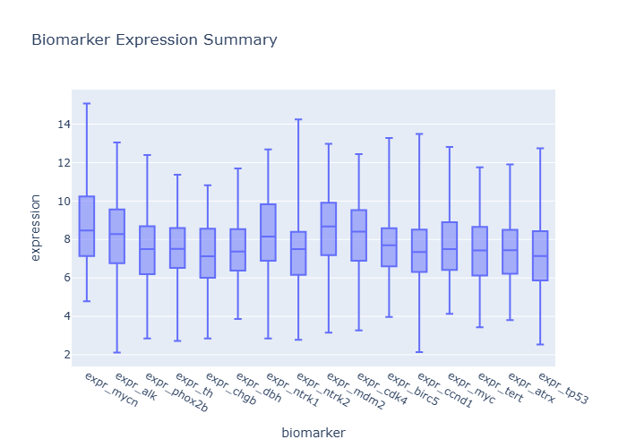
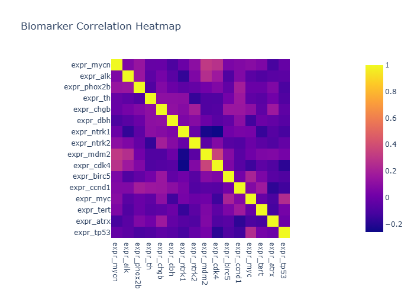
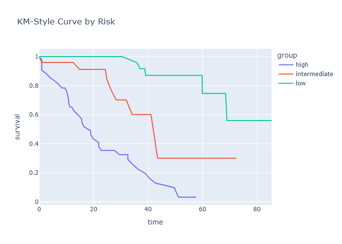
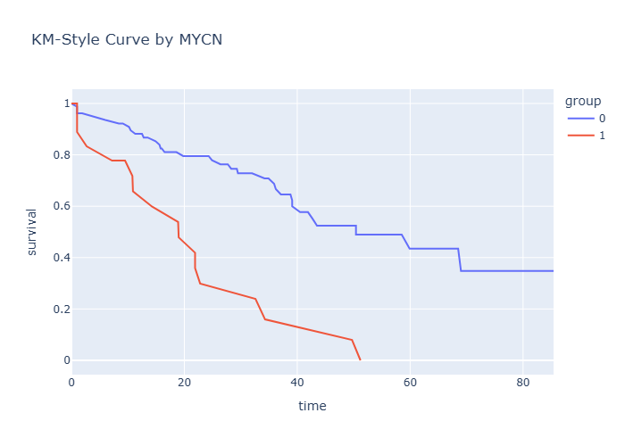
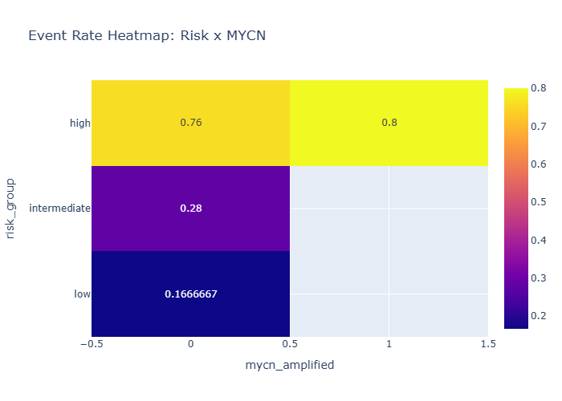
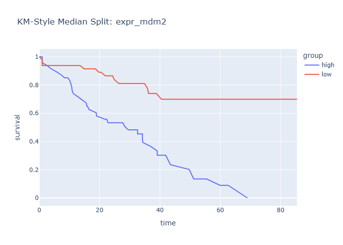

# Final Biomedical Insights

- Generated: 2026-03-22 17:05 UTC
- Individual insight files: 12

## Cohort Context
- Cohort size: 100
- Variables: 23
- Overall event rate: 47.00%
- Median EFS (months): 28.0

## Consolidated Chart Insights

### Clinical Age Distribution

# Insights: Clinical Age Distribution

## Medical Insight
- This figure provides exploratory clinical context for cohort phenotype and outcomes.

## Research Insight
- Age distribution informs external validity and whether age-adjusted analyses are needed.

## Caveat
- Insights are non-causal and exploratory. Missing cells in source data: 0. Measurement error, confounding, and sample-size limits may alter conclusions.

### Clinical Stage Distribution

# Insights: Clinical Stage Distribution

## Medical Insight
- This figure provides exploratory clinical context for cohort phenotype and outcomes.

## Research Insight
- Age distribution informs external validity and whether age-adjusted analyses are needed.

## Caveat
- Insights are non-causal and exploratory. Missing cells in source data: 0. Measurement error, confounding, and sample-size limits may alter conclusions.

### Clinical Risk Distribution

# Insights: Clinical Risk Distribution

## Medical Insight
- The cohort is dominated by 'high' risk patients (45 cases), which can influence aggregate outcome interpretation.

## Research Insight
- This plot supports exploratory hypothesis generation and should be validated in an independent cohort.

## Caveat
- Insights are non-causal and exploratory. Missing cells in source data: 0. Measurement error, confounding, and sample-size limits may alter conclusions.

### Clinical Efs By Risk

# Insights: Clinical Efs By Risk

## Medical Insight
- Median EFS differs across risk strata, with high showing the lowest and low the highest median in this sample.

## Research Insight
- This plot supports exploratory hypothesis generation and should be validated in an independent cohort.

## Caveat
- Insights are non-causal and exploratory. Missing cells in source data: 0. Measurement error, confounding, and sample-size limits may alter conclusions.

### Biomarker Expression Summary

# Insights: Biomarker Expression Summary

## Medical Insight
- This figure provides exploratory clinical context for cohort phenotype and outcomes.

## Research Insight
- Biomarkers with wider spread may offer stronger signal but may also reflect technical variability requiring normalization checks.

## Caveat
- Insights are non-causal and exploratory. Missing cells in source data: 0. Measurement error, confounding, and sample-size limits may alter conclusions.

### Biomarker Mycn Vs Alk

# Insights: Biomarker Mycn Vs Alk

## Medical Insight
- This figure provides exploratory clinical context for cohort phenotype and outcomes.

## Research Insight
- The bivariate structure can motivate interaction terms and subgroup analyses around MYCN/ALK axes.

## Caveat
- Insights are non-causal and exploratory. Missing cells in source data: 0. Measurement error, confounding, and sample-size limits may alter conclusions.

### Biomarker Correlation Heatmap

# Insights: Biomarker Correlation Heatmap

## Medical Insight
- The strongest absolute biomarker-to-biomarker correlation appears moderate at about 0.36, suggesting partial co-expression rather than complete redundancy.

## Research Insight
- Use this map to reduce collinearity in downstream models and to prioritize orthogonal biomarker panels.

## Caveat
- Insights are non-causal and exploratory. Missing cells in source data: 0. Measurement error, confounding, and sample-size limits may alter conclusions.

### Survival Km By Risk

# Insights: Survival Km By Risk

## Medical Insight
- The survival-style curves illustrate time-to-event separation across groups and help identify clinically distinct trajectories.

## Research Insight
- Curve separation can be translated into formal survival modeling hypotheses with adjusted covariates.

## Caveat
- Insights are non-causal and exploratory. Missing cells in source data: 0. Measurement error, confounding, and sample-size limits may alter conclusions.

### Survival Km By Mycn

# Insights: Survival Km By Mycn

## Medical Insight
- The survival-style curves illustrate time-to-event separation across groups and help identify clinically distinct trajectories.

## Research Insight
- Curve separation can be translated into formal survival modeling hypotheses with adjusted covariates.

## Caveat
- Insights are non-causal and exploratory. Missing cells in source data: 0. Measurement error, confounding, and sample-size limits may alter conclusions.

### Survival Event Rate Heatmap

# Insights: Survival Event Rate Heatmap

## Medical Insight
- This figure provides exploratory clinical context for cohort phenotype and outcomes.

## Research Insight
- Risk x MYCN event-rate cells can guide stratified hypothesis tests and sample-size planning for future validation.

## Caveat
- Insights are non-causal and exploratory. Missing cells in source data: 0. Measurement error, confounding, and sample-size limits may alter conclusions.

### Survival Km Median Split Mdm2

# Insights: Survival Km Median Split Mdm2

## Medical Insight
- The survival-style curves illustrate time-to-event separation across groups and help identify clinically distinct trajectories.

## Research Insight
- Curve separation can be translated into formal survival modeling hypotheses with adjusted covariates.

## Caveat
- Insights are non-causal and exploratory. Missing cells in source data: 0. Measurement error, confounding, and sample-size limits may alter conclusions.

### Survival Km Median Split Ntrk1

# Insights: Survival Km Median Split Ntrk1

## Medical Insight
- The survival-style curves illustrate time-to-event separation across groups and help identify clinically distinct trajectories.

## Research Insight
- Curve separation can be translated into formal survival modeling hypotheses with adjusted covariates.

## Caveat
- Insights are non-causal and exploratory. Missing cells in source data: 0. Measurement error, confounding, and sample-size limits may alter conclusions.

