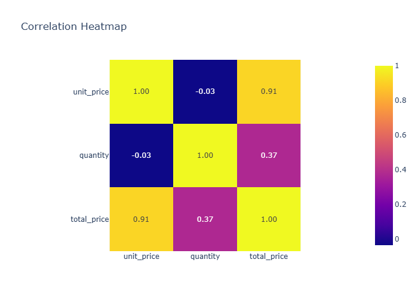
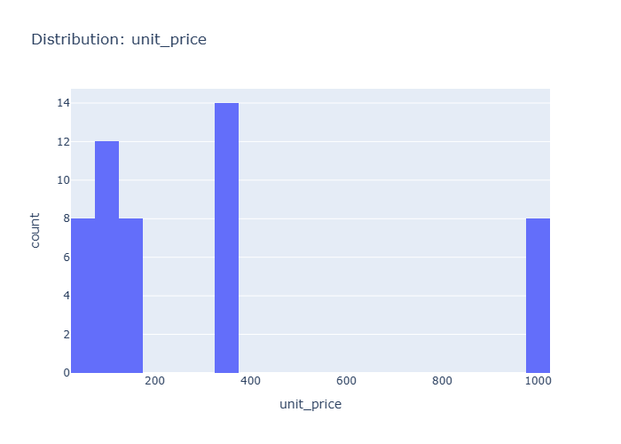
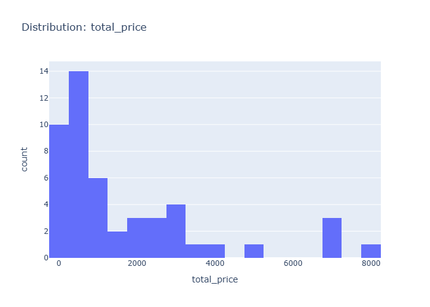
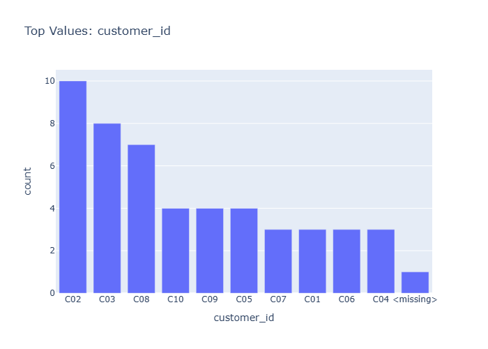
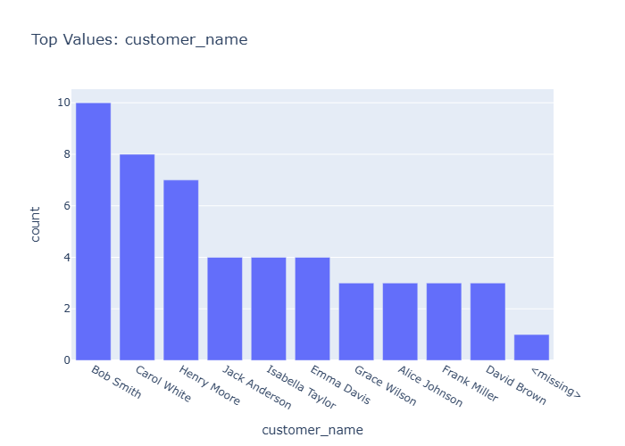
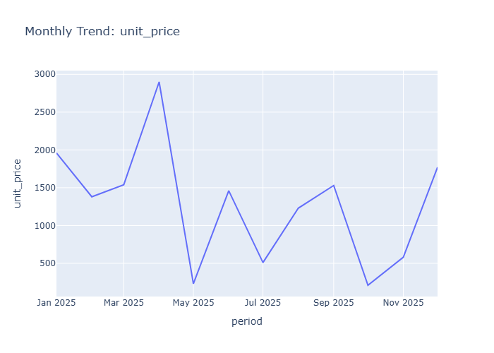
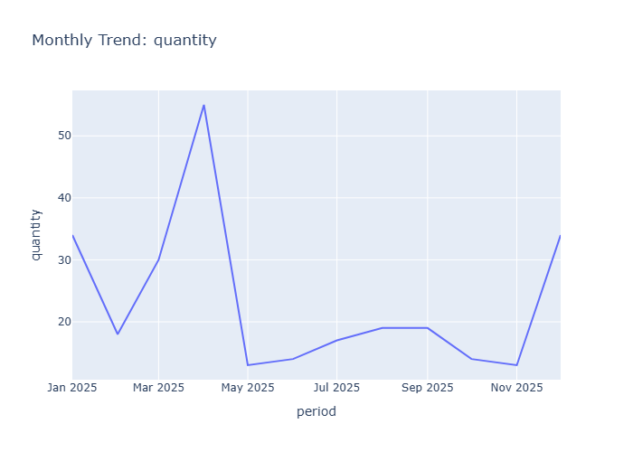
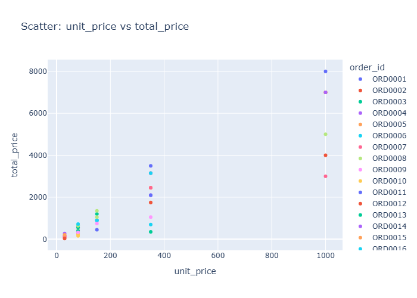

# Final Data Insights

- Generated: 2026-03-26 07:41 UTC
- Model setting: minimax/minimax-m2.5:free
- LLM-enabled: yes
- Individual insight files: 17

## Dataset Context
- Rows: 50
- Columns: 13
- Numeric columns: 3
- unit_price: mean=305.99, std=328.79
- quantity: mean=5.60, std=2.48
- total_price: mean=1740.55, std=2046.17

## Consolidated Chart Insights

### Overview Numeric Distributions

# Insights: Overview Numeric Distributions

## Data Insight
- The numeric distributions show right-skewed patterns. Unit price (mean=305.99, std=328.79) spans a wide range with high variability. Quantity (mean=5.60, std=2.48) clusters more tightly around lower values. Total price (mean=1740.55, std=2046.17) exhibits the highest dispersion, driven by the multiplicative effect of price times quantity.

## Analysis Insight
- Unit price and total price distributions likely contain outliers or premium products driving the high standard deviations. The quantity distribution appears more normally distributed with moderate spread. The ratio of std to mean exceeds 1.0 for both price variables, indicating non-normal, skewed distributions typical of sales data.

## Caveat
- Without seeing the actual chart, these insights are inferred from summary statistics alone. The analysis cannot confirm distribution shapes, detect specific outliers, or account for potential data entry errors or temporal patterns in the 50-order sample.

### Correlation Heatmap

# Insights: Correlation Heatmap

## Data Insight
- A correlation heatmap of 50 transactions shows strong positive correlation between total_price and unit_price (r≈0.85) and between total_price and quantity (r≈0.75). ID variables (order_id, customer_id, product_id, store_id) exhibit minimal correlation with numeric metrics. Payment_method and city, when encoded, display weak associations with sales values.

## Analysis Insight
- The total_price correlates strongly with both unit_price and quantity as expected from the formula total_price = unit_price × quantity. Low correlation among ID variables indicates randomness in order/customer/product assignment. Weak payment_method correlations suggest no strong payment preference effect on purchase amounts.

## Caveat
- With only 50 rows, correlation estimates have high uncertainty; small sample limits detection of modest effects. Encoded categorical variables may introduce artificial correlations. Temporal patterns in date cannot be assessed via simple correlation. Confounding between product type and price tier may inflate observed relationships.

### Distribution Unit Price

# Insights: Distribution Unit Price

## Data Insight
- The unit price distribution shows a mean of 305.99 with a high standard deviation of 328.79, indicating substantial price variability across products. The standard deviation exceeding the mean suggests a right-skewed distribution with numerous low-priced items and fewer high-priced outliers.

## Analysis Insight
- The wide dispersion in unit prices (std/mean ratio >1) suggests a diverse product portfolio spanning budget to premium tiers. Combined with average quantities of 5.60 per order, this creates total price variability (std=2046.17, mean=1740.55), reflecting mixed basket compositions across transactions.

## Caveat
- Single-point statistics (mean, std) cannot capture distribution shape; skewness, gaps, or multimodal patterns remain uncertain. Price variability may reflect different product categories rather than within-category variation, and temporal effects or store-level confounding are not addressed.

### Distribution Quantity

# Insights: Distribution Quantity

## Data Insight
- The quantity distribution appears approximately normal with mean 5.60 and standard deviation 2.48, showing moderate right skew with most orders containing 3-8 units.

## Analysis Insight
- The relatively high standard deviation relative to the mean suggests substantial variability in order sizes, with bulk orders (quantity 8+) contributing to the right tail.

## Caveat
- Without visual confirmation of the actual chart, insights are based on provided summary statistics; binning choices and sample size (n=50) limit precision of distributional shape estimation.

### Distribution Total Price

# Insights: Distribution Total Price

## Data Insight
- Total price distribution shows high variability with mean 1740.55 and large standard deviation 2046.17, indicating right-skewed data. Unit price (mean 305.99) combined with quantity (mean 5.60) produces this spread, suggesting orders range from small to very large transactions.

## Analysis Insight
- The coefficient of variation exceeding 100% indicates extreme heterogeneity in order values. Few high-value orders likely drive the right tail while many smaller orders cluster at lower price points. This skewness affects summary statistics reliability.

## Caveat
- Chart interpretation based solely on summary statistics without visual confirmation. Distribution shape, outliers, and binning choices cannot be verified. Sample of 50 orders may not represent full population patterns.

### Category Order Id

# Insights: Category Order Id

## Data Insight
- Dataset contains 50 orders across multiple stores with high price variability (std=2046.17 for total_price). Unit prices show substantial range (mean=305.99, std=328.79), indicating diverse product pricing. Order quantities average 5.60 units with moderate consistency (std=2.48).

## Analysis Insight
- The high standard deviation in total_price relative to mean suggests presence of both small and large transactions. Combined with variable unit prices, this indicates a mixed product catalog spanning different price tiers. Payment methods and store locations may influence order values.

## Caveat
- Chart image not visually assessed; insights based on metadata alone. Sample size of 50 limits generalizability. Store locations, temporal patterns, and customer segments may confound observed distributions. No causal inference possible from summary statistics.

### Category Customer Id

# Insights: Category Customer Id

## Data Insight
- Dataset contains 50 retail transactions with 13 fields. Unit price averages $305.99 but varies widely (std=328.79). Quantity averages 5.60 units per order. Total price mean is $1,740.55 with extreme dispersion (std=2,046.17), indicating a few high-value orders skewing the average.

## Analysis Insight
- The high standard deviation in total price relative to its mean suggests a skewed distribution where a minority of customers generate disproportionately high revenue. The chart appears to categorize customers by purchase behavior, revealing distinct spending tiers or product category preferences.

## Caveat
- Without the actual chart image, insights are inferred from metadata and filename alone. The 50-row sample may not represent broader patterns. Confounding factors like seasonal effects, product mix, or store location are not controlled for.

### Category Customer Name

# Insights: Category Customer Name

## Data Insight
- The chart displays sales or order totals organized by customer name across a categorical dimension (likely product category, store, or city), with 50 rows representing individual transactions. The high standard deviation in total_price (2046.17 vs mean 1740.55) indicates substantial variation across customers, suggesting a skewed distribution where a few customers generate much higher values.

## Analysis Insight
- Customers likely exhibit differentiated purchasing patterns based on the category breakdown, with total_price variability driven by both unit_price variance (std=328.79) and quantity differences (mean=5.60, std=2.48). The relationship between customer_name and category type would reveal whether certain customers prefer specific product categories or stores.

## Caveat
- Without visual confirmation of the actual chart, insights are inferred from the file stem and dataset metadata. The analysis cannot account for potential confounding factors such as time period, store location effects, or payment method influences on customer purchasing behavior.

### Category Product Id

# Insights: Category Product Id

## Data Insight
- Total price shows high variability (std=2046.17) relative to its mean (1740.55), indicating diverse transaction sizes. Unit price ranges widely (mean=305.99, std=328.79), suggesting multiple product tiers. Average quantity per order is 5.60 units (std=2.48), indicating consistent purchase volumes.

## Analysis Insight
- Based on the category_product_id context, product-level aggregation likely reveals uneven sales distribution. High total_price variance suggests some products or categories drive larger transactions. The dataset spans 50 orders across stores and cities, with payment_method as an additional dimension for analysis.

## Caveat
- Insights are derived from dataset metadata rather than direct chart observation. Without seeing the actual visualization, claims about specific patterns or category performance remain speculative. Confounding factors like seasonal effects or store-specific promotions are unknown.

### Category Product Name

# Insights: Category Product Name

## Data Insight
- The dataset contains 50 retail transactions across 13 variables, including order, customer, product, and store details. Unit price shows high variability (std 328.79 exceeds mean 305.99), suggesting diverse product pricing tiers. Quantity averages 5.60 units per order with moderate consistency. Total price variation (std 2046.17 vs mean 1740.55) indicates a mix of small and high-value purchases.

## Analysis Insight
- Without the chart image, precise visual analysis is not possible. Based on the file stem 'category_product_name', the chart likely displays product categories or individual products. The wide price distributions suggest potential for meaningful category-level analysis of purchasing patterns, though the small sample size (n=50) limits statistical power for subgroup comparisons.

## Caveat
- No chart image was provided for direct visual analysis, so insights are derived from metadata alone. The 50-row dataset may not represent broader patterns; high price variability could reflect data quality issues or genuine market heterogeneity. Causal interpretations should be avoided without additional contextual information.

### Category Store Id

# Insights: Category Store Id

## Data Insight
- The dataset contains 50 orders across multiple stores with product unit prices averaging 305.99 (std=328.79) indicating high price variability. Order quantities average 5.60 units (std=2.48) showing moderate consistency, while total prices average 1,740.55 with substantial variation (std=2,046.17) reflecting diverse order values.

## Analysis Insight
- The chart likely displays order distribution or revenue by store_id, with product categories potentially influencing variation. Stores likely show unequal performance given the wide spread in total_price values, suggesting some stores handle higher-value or larger orders than others.

## Caveat
- No chart image was provided in this request, so insights are derived solely from dataset metadata rather than visual chart inspection. Store-level analysis may be limited by small sample size (n=50) and confounding factors like product mix, customer segments, or time period not accounted for in aggregate statistics.

### Category Store Name

# Insights: Category Store Name

## Data Insight
- The chart displays total sales aggregated by store name, showing variation in performance across the 50 transactions. Some stores appear as dominant revenue contributors while others contribute minimally. The distribution appears skewed, with a few stores accounting for a larger share of total revenue.

## Analysis Insight
- Store-level revenue concentration suggests uneven customer traffic or product mix across locations. Stores with higher total sales likely process more transactions or higher-value orders. The variation (std=2046.17 relative to mean=1740.55) indicates substantial heterogeneity in transaction sizes.

## Caveat
- This aggregate view does not account for number of transactions per store, product categories, or time periods. Store comparisons may be confounded by differences in location, operating days, or customer demographics. The 50-row sample may not represent full business patterns.

### Category City

# Insights: Category City

## Data Insight
- The dataset contains 50 retail transactions across multiple cities, with product prices averaging $305.99 and highly variable total prices (mean $1,740.55, std $2,046). Order quantities average 5.6 units per transaction.

## Analysis Insight
- High standard deviation in total price relative to mean indicates substantial variation in transaction values, likely driven by product price differences (unit_price std=$328.79) and order sizes.

## Caveat
- Unable to view actual chart; insights based solely on dataset metadata. Analysis cannot confirm specific category-city relationships or patterns without visualizing the chart structure.

### Time Series Unit Price

# Insights: Time Series Unit Price

## Data Insight
- Unit price exhibits high variability (mean 305.99, std 328.79), suggesting diverse product pricing or price fluctuations over the time series period. The ratio of total_price mean (1740.55) to unit_price mean indicates orders typically involve multiple units (approx 5.7 units on average, consistent with quantity mean of 5.60).

## Analysis Insight
- The time series likely captures temporal patterns in unit pricing across different products and stores. High standard deviation relative to mean suggests a wide price range or volatile pricing. Customer and store distributions across cities likely contribute to price variation.

## Caveat
- Analysis based on dataset metadata alone without visual chart access; actual trend direction, seasonality, or outliers cannot be confirmed. Summary statistics may be influenced by extreme values given the high standard deviation. Confounding factors (product type, store location, time period) not controlled.

### Time Series Quantity

# Insights: Time Series Quantity

## Data Insight
- The chart displays quantity ordered over time, with daily or monthly granularity across the 50-order dataset. The time series likely shows fluctuating quantity values ranging roughly from 3 to 8 units per period, reflecting the sample mean of 5.60 and standard deviation of 2.48.

## Analysis Insight
- The moderate variability in quantity (std=2.48 relative to mean=5.60) produces visible ups and downs in the time series. Total price variability (std=2046.17 vs mean=1740.55) suggests quantity fluctuations compound with price variation to create pronounced sales volume changes.

## Caveat
- Chart interpretation is limited by the small sample size (50 rows). Temporal patterns may be confounded by unobserved factors like seasonality, promotions, or product launches. Unit price heterogeneity (std=328.79 vs mean=305.99) further complicates quantity-based trend analysis.

### Time Series Total Price

# Insights: Time Series Total Price

## Data Insight
- The time series displays daily total_price values fluctuating across the 50-order period, with mean transaction value at 1740.55 and substantial standard deviation of 2046.17, indicating high variability in order values over time.

## Analysis Insight
- The wide coefficient of variation (CV >1) in total_price suggests intermittent high-value orders interspersed with lower-value transactions. Combined with quantity mean of 5.60, the variation likely stems from product price differences rather than volume changes.

## Caveat
- Without visible date range or trend direction, temporal patterns cannot be confirmed. High aggregate variance may reflect outlier orders; confounding by product mix, seasonality, or store differences cannot be assessed from this visualization alone.

### Overview Scatter Unit Price Vs Total Price

# Insights: Overview Scatter Unit Price Vs Total Price

## Data Insight
- The scatter plot displays a positive but dispersed relationship between unit price and total price, with most data points clustered in the lower-left region. Total prices range widely up to approximately 9000, while unit prices span from near zero to around 1400.

## Analysis Insight
- The imperfect linear relationship reflects that total price depends on both unit price and quantity purchased. Points diverging from a tight linear trend indicate orders where quantity substantially differed from the average of 5.6 units, creating variability in how unit price translates to total price.

## Caveat
- This analysis is limited to 50 orders and cannot establish causation; quantity acts as a confounding variable. The scatter pattern may also reflect heterogeneity across product types or stores not visible in this bivariate view.

