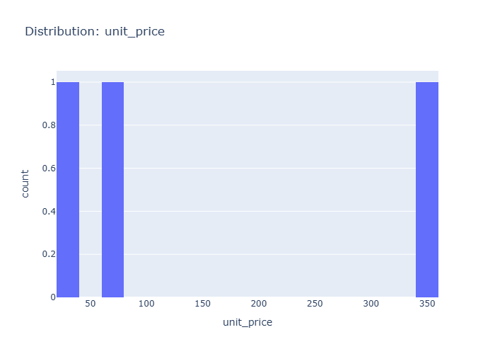
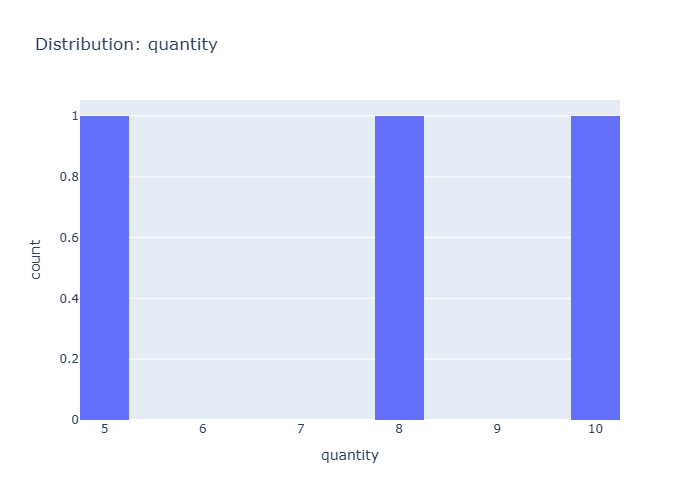
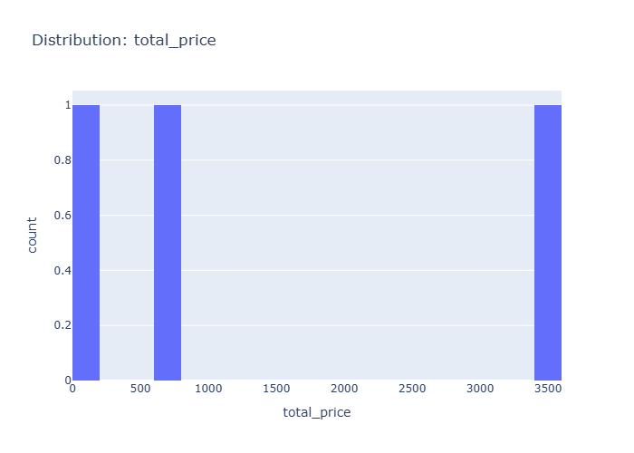
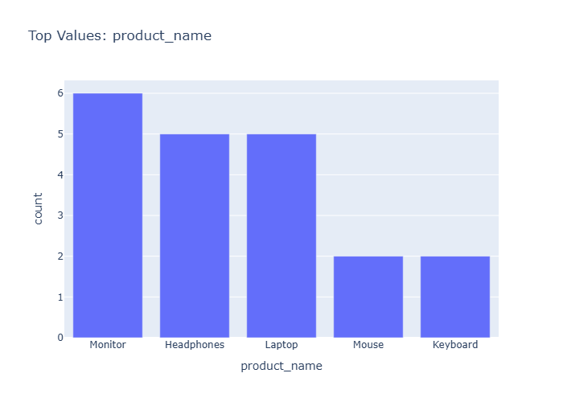
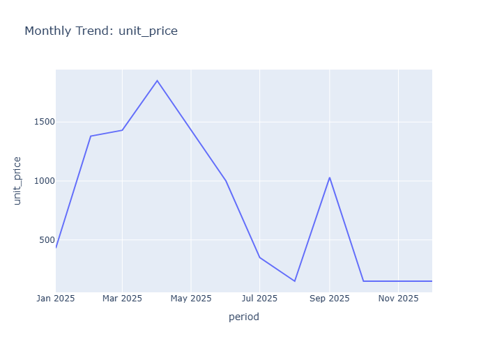
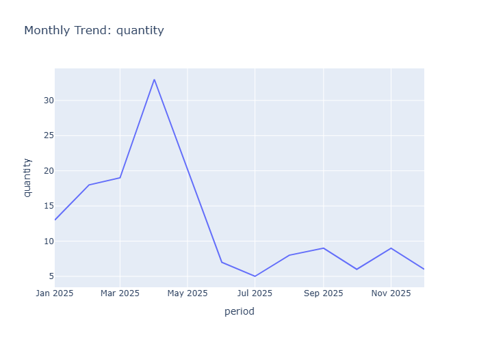

# Final Data Insights

- Generated: 2026-04-21 05:58 UTC
- Model setting: google/gemini-2.5-flash-lite
- LLM-enabled: yes
- Individual insight files: 12

## Dataset Context
- Rows: 20
- Columns: 7
- Numeric columns: 3
- unit_price: mean=403.49, std=370.34
- quantity: mean=6.65, std=1.95
- total_price: mean=2695.93, std=2567.29

## Consolidated Chart Insights

## Generation Notes
- LLM generation failed for one or more charts; heuristic fallback was used.
- overview_numeric_distributions.png: Error code: 401 - {'error': {'message': 'User not found.', 'code': 401}}
- correlation_heatmap.png: Error code: 401 - {'error': {'message': 'User not found.', 'code': 401}}
- distribution_unit_price.png: Error code: 401 - {'error': {'message': 'User not found.', 'code': 401}}
- distribution_quantity.png: Error code: 401 - {'error': {'message': 'User not found.', 'code': 401}}
- distribution_total_price.png: Error code: 401 - {'error': {'message': 'User not found.', 'code': 401}}
- category_order_id.png: Error code: 401 - {'error': {'message': 'User not found.', 'code': 401}}
- category_product_name.png: Error code: 401 - {'error': {'message': 'User not found.', 'code': 401}}
- category_city.png: Error code: 401 - {'error': {'message': 'User not found.', 'code': 401}}
- time_series_unit_price.png: Error code: 401 - {'error': {'message': 'User not found.', 'code': 401}}
- time_series_quantity.png: Error code: 401 - {'error': {'message': 'User not found.', 'code': 401}}
- time_series_total_price.png: Error code: 401 - {'error': {'message': 'User not found.', 'code': 401}}
- overview_scatter_unit_price_vs_total_price.png: Error code: 401 - {'error': {'message': 'User not found.', 'code': 401}}

### Overview Numeric Distributions

# Insights: Overview Numeric Distributions

## Data Insight
- The dataset contains 3 numeric column(s). This chart compares their spread, helping spot outliers and scale differences.

## Analysis Insight
- Consider normalising or scaling columns with very different ranges before applying distance-based algorithms.

## Caveat
- Insights are exploratory and non-causal. Missing cells in source data: 0. Sample size, data quality, and unmeasured variables may affect conclusions.

### Correlation Heatmap

# Insights: Correlation Heatmap

## Data Insight
- The strongest correlation is between 'unit_price' and 'total_price' (r ≈ 0.94), suggesting these columns move together and may be related.

## Analysis Insight
- Use this map to reduce collinearity in downstream models and prioritise orthogonal feature subsets.

## Caveat
- Insights are exploratory and non-causal. Missing cells in source data: 0. Sample size, data quality, and unmeasured variables may affect conclusions.

### Distribution Unit Price

# Insights: Distribution Unit Price

## Data Insight
- The distribution of 'unit price' reveals the spread and shape of values. Skewed distributions or outliers may warrant transformation before modelling.

## Analysis Insight
- Highly skewed distributions may benefit from log or Box-Cox transformation before statistical modelling.

## Caveat
- Insights are exploratory and non-causal. Missing cells in source data: 0. Sample size, data quality, and unmeasured variables may affect conclusions.

### Distribution Quantity

# Insights: Distribution Quantity

## Data Insight
- The distribution of 'quantity' reveals the spread and shape of values. Skewed distributions or outliers may warrant transformation before modelling.

## Analysis Insight
- Highly skewed distributions may benefit from log or Box-Cox transformation before statistical modelling.

## Caveat
- Insights are exploratory and non-causal. Missing cells in source data: 0. Sample size, data quality, and unmeasured variables may affect conclusions.

### Distribution Total Price

# Insights: Distribution Total Price

## Data Insight
- The distribution of 'total price' reveals the spread and shape of values. Skewed distributions or outliers may warrant transformation before modelling.

## Analysis Insight
- Highly skewed distributions may benefit from log or Box-Cox transformation before statistical modelling.

## Caveat
- Insights are exploratory and non-causal. Missing cells in source data: 0. Sample size, data quality, and unmeasured variables may affect conclusions.

### Category Order Id

# Insights: Category Order Id

## Data Insight
- 'ORD0001' is the most frequent value in 'order_id'. Imbalanced categories may skew aggregates and require stratified analysis.

## Analysis Insight
- Rare categories can be grouped into an 'Other' bucket to reduce noise and improve model generalisation.

## Caveat
- Insights are exploratory and non-causal. Missing cells in source data: 0. Sample size, data quality, and unmeasured variables may affect conclusions.

### Category Product Name

# Insights: Category Product Name

## Data Insight
- 'Monitor' is the most frequent value in 'product_name'. Imbalanced categories may skew aggregates and require stratified analysis.

## Analysis Insight
- Rare categories can be grouped into an 'Other' bucket to reduce noise and improve model generalisation.

## Caveat
- Insights are exploratory and non-causal. Missing cells in source data: 0. Sample size, data quality, and unmeasured variables may affect conclusions.

### Category City

# Insights: Category City

## Data Insight
- 'Los Angeles' is the most frequent value in 'city'. Imbalanced categories may skew aggregates and require stratified analysis.

## Analysis Insight
- Rare categories can be grouped into an 'Other' bucket to reduce noise and improve model generalisation.

## Caveat
- Insights are exploratory and non-causal. Missing cells in source data: 0. Sample size, data quality, and unmeasured variables may affect conclusions.

### Time Series Unit Price

# Insights: Time Series Unit Price

## Data Insight
- The monthly trend for 'unit price' highlights seasonality, growth, or decline patterns over time.

## Analysis Insight
- Decompose the series into trend, seasonality, and residual components to improve forecasting accuracy.

## Caveat
- Insights are exploratory and non-causal. Missing cells in source data: 0. Sample size, data quality, and unmeasured variables may affect conclusions.

### Time Series Quantity

# Insights: Time Series Quantity

## Data Insight
- The monthly trend for 'quantity' highlights seasonality, growth, or decline patterns over time.

## Analysis Insight
- Decompose the series into trend, seasonality, and residual components to improve forecasting accuracy.

## Caveat
- Insights are exploratory and non-causal. Missing cells in source data: 0. Sample size, data quality, and unmeasured variables may affect conclusions.

### Time Series Total Price

# Insights: Time Series Total Price

## Data Insight
- The monthly trend for 'total price' highlights seasonality, growth, or decline patterns over time.

## Analysis Insight
- Decompose the series into trend, seasonality, and residual components to improve forecasting accuracy.

## Caveat
- Insights are exploratory and non-causal. Missing cells in source data: 0. Sample size, data quality, and unmeasured variables may affect conclusions.

### Overview Scatter Unit Price Vs Total Price

# Insights: Overview Scatter Unit Price Vs Total Price

## Data Insight
- This scatter plot reveals the relationship between two numeric columns. Clusters or linear trends can motivate correlation and regression analyses.

## Analysis Insight
- The bivariate structure can motivate interaction terms and subgroup analyses in regression models.

## Caveat
- Insights are exploratory and non-causal. Missing cells in source data: 0. Sample size, data quality, and unmeasured variables may affect conclusions.

