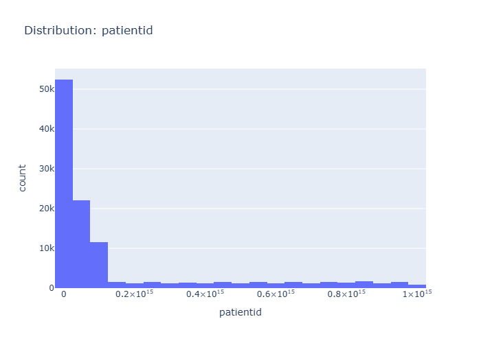
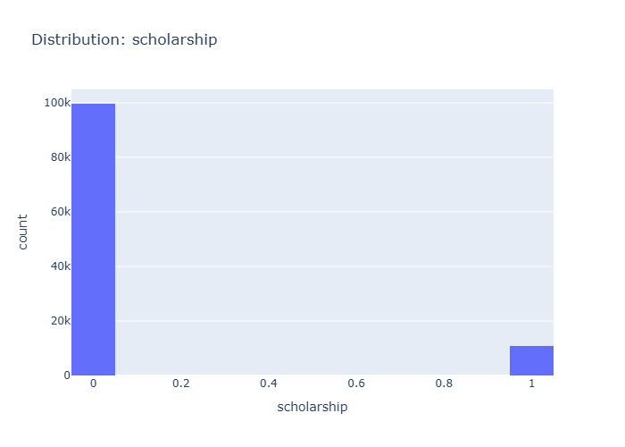
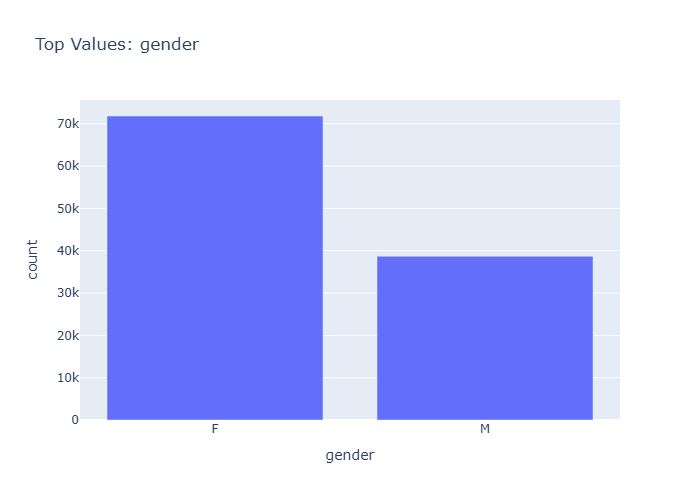
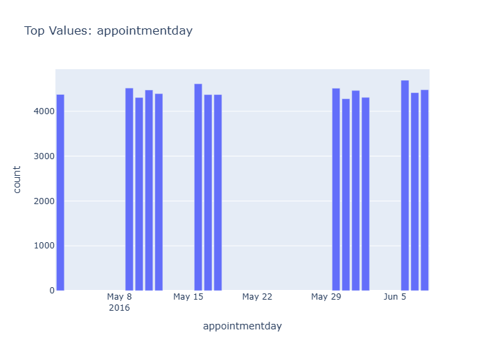
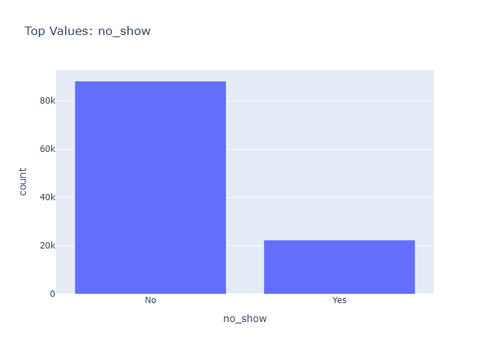

# Final Data Insights

- Generated: 2026-05-10 12:38 UTC
- Model setting: google/gemini-2.5-flash-lite
- LLM-enabled: yes
- Individual insight files: 12

## Dataset Context
- Rows: 110527
- Columns: 14
- Numeric columns: 9
- patientid: mean=147496265710394.06, std=256094920291739.09
- appointmentid: mean=5675305.12, std=71295.75
- age: mean=37.09, std=23.11

## Consolidated Chart Insights

### Overview Numeric Distributions

# Insights: Overview Numeric Distributions

## Data Insight
- The 'patientid' column exhibits extreme variability in its values, with a mean around 1.47e15 and a very large standard deviation. The other numeric columns ('appointmentid', 'age', 'scholarship', 'hipertension', 'diabetes', 'alcoholism', 'handcap', 'sms_received') show much smaller and more concentrated distributions, with 'age' having the largest spread among them.

## Analysis Insight
- The box plot clearly highlights that 'patientid' and 'appointmentid' are identifiers with very large numerical ranges, while 'age' and binary/categorical features like 'scholarship', 'hipertension', 'diabetes', 'alcoholism', 'handcap', and 'sms_received' have small, near-zero values when represented numerically. This suggests distinct data types and scales within the dataset.

## Caveat
- The box plot for 'patientid' appears truncated on the y-axis, potentially obscuring extreme outliers or the full range of its distribution. The extremely large values in 'patientid' and 'appointmentid' are likely identifiers and not intended for direct quantitative analysis or comparison with other features.

### Correlation Heatmap

# Insights: Correlation Heatmap

## Data Insight
- The heatmap shows moderate positive correlations between hypertension and diabetes (0.43), and between age and hypertension (0.50). 'Sms_received' exhibits a notable negative correlation with 'appointmentid' (-0.26). Most other variable pairs show very weak correlations, close to zero.

## Analysis Insight
- Age is moderately correlated with hypertension, suggesting older individuals may have higher rates of this condition. The negative correlation between 'sms_received' and 'appointmentid' is intriguing and warrants further investigation into appointment scheduling nuances.

## Caveat
- Correlation does not imply causation. The heatmap displays linear relationships; non-linear associations may exist. Unseen confounding variables could influence observed correlations between different health conditions and appointment-related factors.

### Distribution Patientid

# Insights: Distribution Patientid

## Data Insight
- The histogram shows a highly skewed distribution of patient IDs. The vast majority of observations have patient IDs clustered near zero, with a sharp decline in counts as patient ID values increase. Few patients have very large patient ID values.

## Analysis Insight
- Most appointments are associated with a small number of patients, indicated by the high frequency of low patient IDs. The long tail suggests some patients may have very large IDs, which could be due to data entry, system changes, or a small number of chronically ill patients.

## Caveat
- The patient ID distribution might be an artifact of the ID generation system rather than reflecting patient behavior. Without knowing the ID assignment logic, it's difficult to interpret the meaning of the skew or the presence of very large IDs.

### Distribution Appointmentid

# Insights: Distribution Appointmentid

## Data Insight
- The histogram shows the distribution of 'appointmentid'. The majority of appointment IDs are concentrated in the higher range, specifically in bins around 5.6M to 5.8M, with a peak count exceeding 30,000. There are very few appointments with IDs below 5.4M.

## Analysis Insight
- The distribution of 'appointmentid' appears to be right-skewed, with a long tail of lower counts at the lower end of the ID range. The mode is located in the 5.7M to 5.8M range, indicating most appointments fall within this identifier group.

## Caveat
- The 'appointmentid' is likely an arbitrary numerical identifier. Its distribution may not reflect any meaningful underlying trend or characteristic of the appointments themselves. The observed structure could be an artifact of how these IDs were generated or assigned sequentially.

### Distribution Age

# Insights: Distribution Age

## Data Insight
- The histogram shows the distribution of patient ages, representing the count of patients within specific age ranges. The highest counts are observed for the youngest age groups, with a noticeable decline in patient numbers as age increases, particularly after age 60.

## Analysis Insight
- The age distribution is right-skewed, indicating that the majority of patients are younger. There are smaller, but still significant, counts of older patients. The distribution suggests a broad range of patient ages, with a concentration in the younger to middle-aged demographics.

## Caveat
- The chart displays counts per age bin, not the exact age of each patient. This aggregation may obscure finer patterns within age groups. The dataset's scope (e.g., specific clinic or region) could influence the observed age distribution.

### Distribution Scholarship

# Insights: Distribution Scholarship

## Data Insight
- The distribution chart for 'scholarship' shows that approximately 100,000 records do not have a scholarship (value 0), while around 12,000 records have a scholarship (value 1).

## Analysis Insight
- The vast majority of patients in this dataset do not receive a scholarship. This suggests that scholarship recipients represent a small minority within the patient population studied.

## Caveat
- The chart displays a binary distribution. It's unclear if 'scholarship' is a boolean indicator or represents different scholarship tiers, and the reasons for receiving or not receiving a scholarship are not provided.

### Distribution Hipertension

# Insights: Distribution Hipertension

## Data Insight
- The distribution of hypertension shows a significant imbalance. Approximately 85,000 individuals in the dataset do not have hypertension (value 0), while only about 20,000 have it (value 1).

## Analysis Insight
- A large majority of the patients do not have hypertension. This suggests that hypertension is not a prevalent condition within this specific patient cohort. Further investigation into the characteristics of hypertensive patients could be beneficial.

## Caveat
- The chart displays raw counts and does not account for potential confounding factors like age or other health conditions. The binary nature of the 'hipertension' column may also oversimplify the condition's severity or diagnosis criteria.

### Distribution Diabetes

# Insights: Distribution Diabetes

## Data Insight
- The distribution of diabetes shows a vastly imbalanced dataset. Approximately 100,000 patients do not have diabetes (value 0), while only around 10,000 patients have diabetes (value 1).

## Analysis Insight
- The 'diabetes' column is a binary variable, indicating the presence or absence of the condition. The visualization highlights a significant majority of non-diabetic patients within the dataset, suggesting a potential bias if not handled properly in subsequent analyses.

## Caveat
- The chart displays raw counts. It's unclear if the dataset represents a general population sample or a specific patient cohort, which could influence the observed diabetes prevalence. The resolution of the chart limits precise count extraction.

### Category Gender

# Insights: Category Gender

## Data Insight
- The chart displays the distribution of patients by gender, showing that there are significantly more female patients (F) than male patients (M) in the dataset. The count for females is approximately 70,000, while for males it is around 40,000.

## Analysis Insight
- The visualization highlights a notable gender imbalance in the patient population represented in the dataset. This disparity could influence findings when analyzing other variables, as trends might be skewed by the larger number of female patients.

## Caveat
- The chart only presents gender distribution. It does not account for potential demographic factors that might influence healthcare-seeking behavior or data recording practices, which could confound the observed gender distribution.

### Category Appointmentday

# Insights: Category Appointmentday

## Data Insight
- The number of appointments is relatively consistent across the observed dates, with slight peaks on May 8th, 2016, and June 5th. Most days show counts around 4,300 to 4,500.

## Analysis Insight
- Appointment volume exhibits a stable pattern across the sampled days within May and early June 2016. The distribution suggests no major seasonal or event-driven fluctuations in appointment scheduling during this period.

## Caveat
- This analysis only considers specific dates and does not account for all appointment days. Trends might differ across other months or years, and external factors influencing scheduling are not included.

### Category No Show

# Insights: Category No Show

## Data Insight
- The vast majority of appointments, approximately 82,000, had patients show up. Only about 22,000 appointments resulted in a no-show.

## Analysis Insight
- The chart indicates a significant difference in the frequency of patients attending appointments versus not showing up. The number of no-shows is considerably lower than the number of attendees.

## Caveat
- The data does not provide reasons for no-shows, nor does it account for factors like appointment rescheduling or cancellations. This analysis is based solely on the provided 'no_show' column.

### Overview Scatter Age Vs Hipertension

# Insights: Overview Scatter Age Vs Hipertension

## Data Insight
- The scatter plot shows a clear separation of data points. Individuals with hypertension (hipertension=1) are predominantly older, clustered around ages 50-80. Patients without hypertension (hipertension=0) are spread across a wider age range, from very young to older individuals.

## Analysis Insight
- Hypertension appears to be more prevalent in older age groups. The data suggests a strong association between advanced age and the presence of hypertension, with few younger individuals exhibiting this condition.

## Caveat
- This analysis is based on observational data. Other factors like lifestyle, genetics, or concurrent conditions (not visualized) could influence hypertension. The data does not confirm causality, only correlation, and may not represent all age groups equally.

