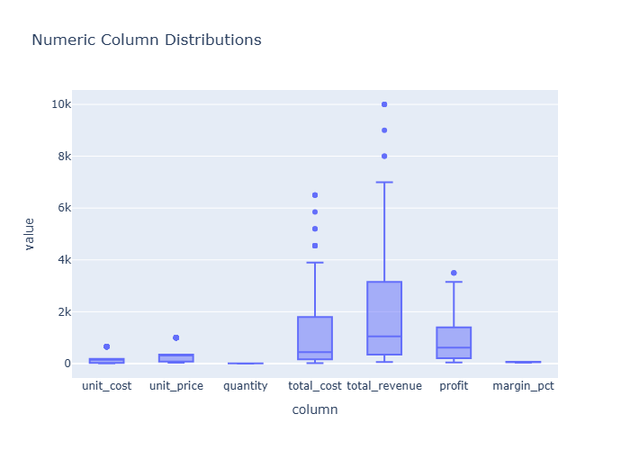

# Insights: Overview Numeric Distributions

## Data Insight
- The chart displays distributions for numeric variables including unit_cost, unit_price, quantity, and total_cost. Unit_cost shows right-skew with mean 219.84 and high dispersion (std=252.72). Unit_price distributes similarly with higher mean (376.69) and substantial spread (std=370.50). Quantity appears more concentrated around moderate values (mean=6.12, std=2.88), suggesting tighter clustering. Total_cost shows widest range (std=1753.29 relative to mean 1341.73).

## Analysis Insight
- High coefficient of variation across cost and price variables indicates heterogeneous product mix or pricing strategy. Quantity's lower relative variability suggests consistent order volumes. Right-skewed distributions imply presence of high-value outliers driving the right tail. The gap between unit_price and unit_cost (mean difference ~157) reflects typical profit margin structure across the dataset.

## Caveat
- Distribution shapes cannot confirm outlier validity without examining individual records. Store, product, and temporal factors may confound observed patterns. Sample size (n=100) limits generalizability. Missing columns in distribution overview may hide important relationships affecting these numeric patterns.
