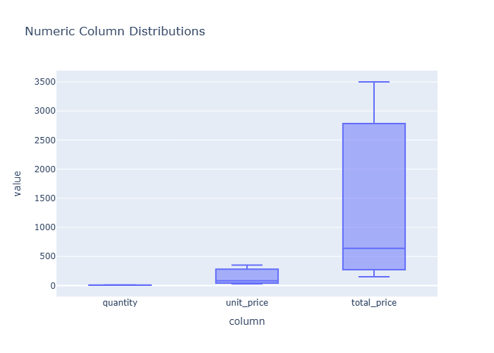

# Insights: Overview Numeric Distributions

## Data Insight
- The dataset contains 3 numeric column(s). This chart compares their spread, helping spot outliers and scale differences.

## Analysis Insight
- Consider normalising or scaling columns with very different ranges before applying distance-based algorithms.

## Caveat
- Insights are exploratory and non-causal. Missing cells in source data: 0. Sample size, data quality, and unmeasured variables may affect conclusions.
