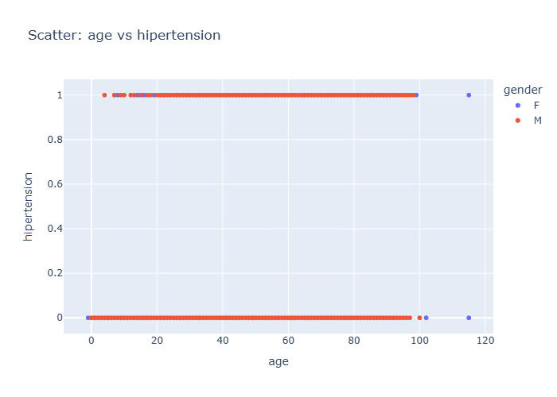

# Insights: Overview Scatter Age Vs Hipertension

## Data Insight
- The scatter plot shows a distinct pattern: individuals with hypertension (hipertension=1) are clustered at higher ages, generally above 40. Conversely, those without hypertension (hipertension=0) are spread across a wider age range, including younger individuals.

## Analysis Insight
- There appears to be a strong association between older age and the presence of hypertension. Most individuals in the dataset across various ages do not have hypertension, while hypertension cases are predominantly observed in older age groups.

## Caveat
- This visualization does not account for other factors that could influence hypertension, such as lifestyle or pre-existing conditions. The data may also have limitations in capturing the full spectrum of health conditions across all age groups.
