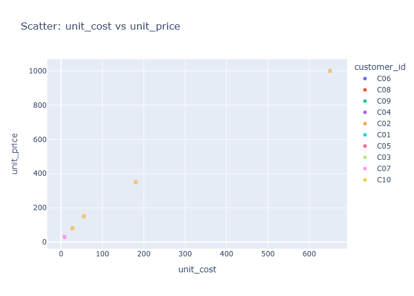

# Insights: Overview Scatter Unit Cost Vs Unit Price

## Data Insight
- Scatter plot displays unit cost (mean 219.84) on x-axis versus unit price (mean 376.69) on y-axis. Points spread widely reflecting high standard deviations (252.72 and 370.50 respectively). Most points appear above the diagonal line where unit price equals unit cost, indicating unit price generally exceeds unit cost.

## Analysis Insight
- Positive markup trend visible with average price-to-cost ratio approximately 1.7x. Wider vertical spread at higher unit costs suggests variable pricing strategies for higher-cost products. Profitability is evident as most transactions show positive margin, though scatter distribution indicates substantial variation in pricing efficiency across products.

## Caveat
- Chart-specific outliers cannot be confirmed without visual inspection. Relationship may be confounded by product type, store location, or time period. Data quality depends on consistent cost allocation methodology across the 100 transactions.
