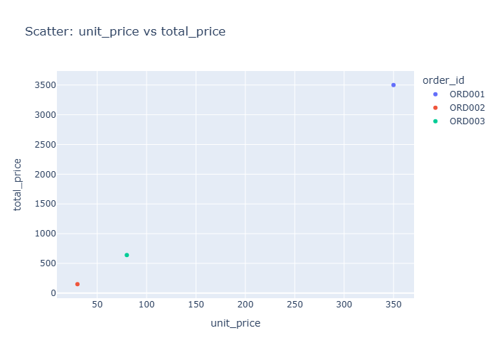

# Insights: Overview Scatter Unit Price Vs Total Price

## Data Insight
- This scatter plot reveals the relationship between two numeric columns. Clusters or linear trends can motivate correlation and regression analyses.

## Analysis Insight
- The bivariate structure can motivate interaction terms and subgroup analyses in regression models.

## Caveat
- Insights are exploratory and non-causal. Missing cells in source data: 0. Sample size, data quality, and unmeasured variables may affect conclusions.
