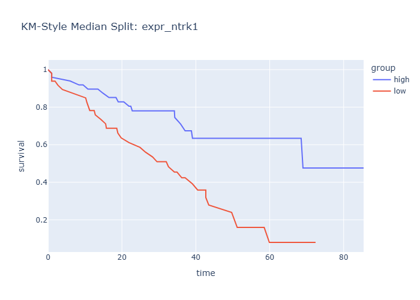

# Insights: Survival Km Median Split Ntrk1

## Medical Insight
- The survival-style curves illustrate time-to-event separation across groups and help identify clinically distinct trajectories.

## Research Insight
- Curve separation can be translated into formal survival modeling hypotheses with adjusted covariates.

## Caveat
- Insights are non-causal and exploratory. Missing cells in source data: 0. Measurement error, confounding, and sample-size limits may alter conclusions.
