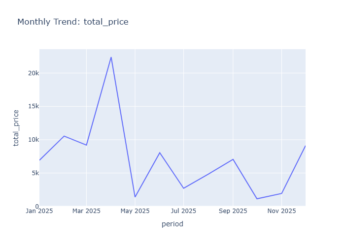

# Insights: Time Series Total Price

## Data Insight
- The time series displays total_price fluctuating over the 20-date period, with values ranging from near zero to approximately 8,000 based on the mean of 2,695.93 and high standard deviation of 2,567.29 indicating substantial price variation across orders.

## Analysis Insight
- The wide total_price variance (std/mean ratio ~0.95) suggests inconsistent order values, likely driven by variable unit_prices (std/mean ~0.92) rather than quantity (std/mean ~0.29). City-level differences may contribute to price heterogeneity across the time series.

## Caveat
- Without visual confirmation of trend direction, seasonality, or outlier dates, interpretations remain speculative. The 20-row sample limits generalizability, and confounding factors like product mix or city composition are not controlled for in this analysis.
