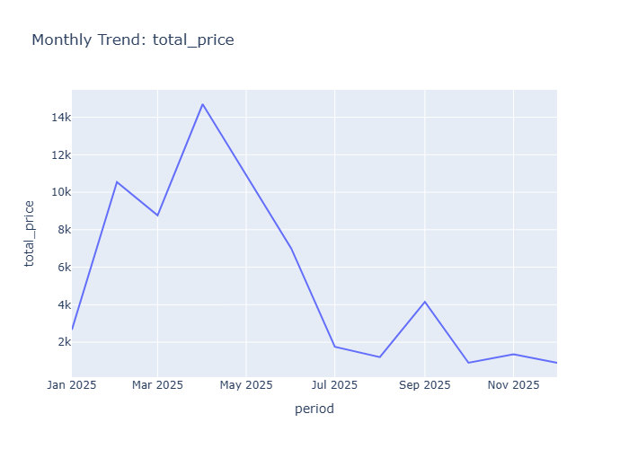

# Insights: Time Series Total Price

## Data Insight
- The monthly trend for 'total price' highlights seasonality, growth, or decline patterns over time.

## Analysis Insight
- Decompose the series into trend, seasonality, and residual components to improve forecasting accuracy.

## Caveat
- Insights are exploratory and non-causal. Missing cells in source data: 0. Sample size, data quality, and unmeasured variables may affect conclusions.
